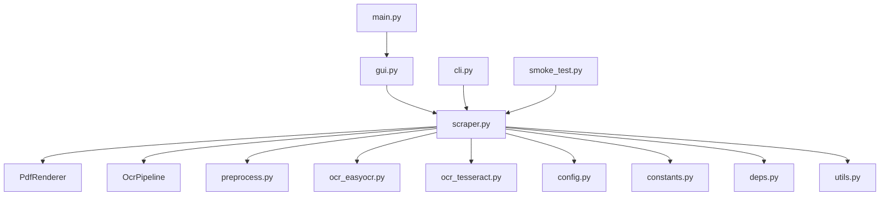

# PDF Scraper Codebase Review and Improvement Plan

## 1. Project Overview

The PDF Scraper is a local OCR application with both GUI (Tkinter) and CLI interfaces, optimized for Bangla language processing. It combines EasyOCR (primary) with Tesseract (refinement for low-confidence text) and uses Poppler for PDF rendering.

## 2. Current Architecture

### System Components

### Core Files
- `main.py`: GUI entry point
- `gui.py`: Tkinter interface with progress tracking
- `cli.py`: Command-line interface
- `scraper.py`: Main OCR orchestrator (PdfRenderer + OcrPipeline)
- `preprocess.py`: Image preprocessing utilities
- `ocr_easyocr.py`: EasyOCR integration
- `ocr_tesseract.py`: Tesseract integration with multi-pass strategy
- `config.py`: Configuration dataclasses
- `constants.py`: OCR parameters
- `deps.py`: Dependency management
- `utils.py`: Utility functions
- `smoke_test.py`: Simple test runner

## 3. Strengths of Current Implementation

1. **Robust Error Handling**: Extensive try-except blocks with fallback mechanisms
2. **Lazy Loading**: Dependencies are loaded on demand for faster startup
3. **Multi-platform Support**: Windows, macOS, and Linux
4. **Well-documented**: Clear comments and README with installation instructions
5. **Configurable**: Many OCR parameters can be tuned via constants
6. **Quality vs Speed Tradeoff**: User-selectable modes for different use cases

## 4. Areas for Improvement

### High Priority
1. **Testing Coverage**: Add comprehensive unit tests and integration tests
2. **Configuration System**: Replace hardcoded constants with a config file (YAML/JSON)
3. **Logging System**: Centralize logging with structured output

### Medium Priority
1. **Modularity**: Improve separation of concerns in large classes (e.g., scraper.py)
2. **Documentation**: Add docstrings to all functions and classes
3. **Performance Monitoring**: Add metrics for OCR performance

### Low Priority
1. **UI/UX Improvements**: Enhance GUI with more features and better design
2. **Output Formats**: Support additional output formats (e.g., JSON, HTML)

## 5. Improvement Plan

### Phase 1: Foundation (High Priority)
- [ ] Create comprehensive test suite
- [ ] Implement configuration system
- [ ] Centralize logging system

### Phase 2: Refinement (Medium Priority)
- [ ] Improve code modularity
- [ ] Add complete documentation
- [ ] Implement performance monitoring

### Phase 3: Enhancement (Low Priority)
- [ ] Improve UI/UX
- [ ] Add support for additional output formats

## 6. Next Steps

1. Review the current codebase structure
2. Create a detailed task list for each improvement phase
3. Prioritize tasks based on impact and effort
4. Begin implementing the improvements

## 7. Approval

Please review this plan and let me know if you agree with the scope and prioritization. I'm happy to make any changes based on your feedback.
